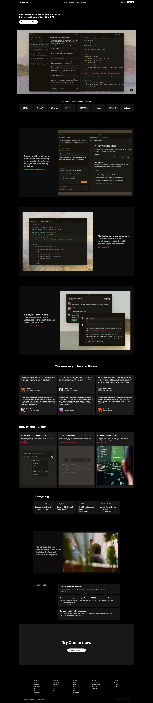

# Cursor Landing Page (HTML + Vanilla CSS)

Structural recreation of a Cursor-style landing page using plain HTML and vanilla CSS (no Tailwind). This project focuses on layout/structure, sections, and hover states.



## Tech

- HTML: `index.html`
- CSS: `script.css`
- Assets (images + fonts): `assets/`

## How to run

You can open the file directly, but using a local server is recommended (so fonts/assets load consistently).

### Option 1: Simple local server (Python)

```bash
cd cursor-landing
python3 -m http.server 5173
```

Then open `http://localhost:5173`.

### Option 2: Open directly

Open `index.html` in a browser.

## Page sections (structure)

The page is built as a single document with these major sections:

- Navbar (fixed)
- Main CTA (hero text + download button)
- Hero image/banner
- Company logos grid
- Feature rows (image + text)
- Testimonials grid
- “Stay on the frontier” (bento-style cards)
- Changelog grid
- Careers / “Join us” callout
- Recent highlights list (hoverable cards)
- “Try Cursor now” CTA
- Footer (multi-column links + bottom controls)

## Styling approach

- Hover states are implemented in CSS (e.g., changelog cards and highlight cards use a slightly lighter background on hover).
- The layout uses flexbox/grid and percentage-based widths to keep the content centered.

## Fonts

`script.css` loads CursorGothic from `assets/fonts/` via `@font-face` and applies it to `body`.

## Notes

- A Tailwind-based version also exist as `index-tailwind-backup.html`.
